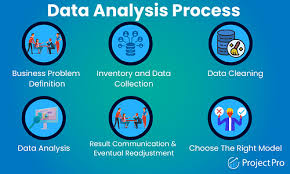

# Inventory2
This is an inventory management system analysis using SQL, TABLEAU AND POWERbI

## INTRODUCTION
This is an Inventory Management analysis done with SQL and PowerBI, I analyzed Inventory data, production data and Sales data from the AdventureWorks 2019 database. It is a fictitious company named "FitCapacity" and it is intended to solve some problems.
Disclaimer This is not a real company as we know that adventure works database is compiled by Microsoft for learning purposes

## PROBLEM STATEMENT

The goal of the analysis is to:
+ identify which products have the highest turnover rate and which have the lowest turnover rate.
* identify the average time a product is out of stock and the frequency of stockouts.
- classify products into high-selling, low-selling and average-selling.
- use the insights gained to make recommendations for how to optimize inventory levels and minimize stockouts which may include adjustments to reorder points, ordering certain products, or discontinuing products that are not selling well.
+ GJYG YT URUKRK UFKU

## DATA SOURCE

The data used for this work is obtained from the AdventureWorks 2019 database 2019. I studied the Schema, Objects related to the Schema, data dictionary and found the right tables for the analysis.
•	You can find a link to get started with installation and restoration of the database to your local machine. here:

## SKILLS AND DEMONSTARTED
- SQL (Select, alias, Views)
- PowerBI concepts like:
+ creating columns for calculations for dates, time, and duration
* Creating key performance indicators (KPIs) and other business calculations,
o	Developing general DAX calculations that deal with text and numbers,
o	Performed advanced DAX calculations for solving statistical measures and other mathematical formulas
o	Data Modelling,
o	Measures,
o	Navigation panes,
o	filters,
o	tooltips,
o	buttons,
o	bookmarks,
o	Data Visualization

## DATA ANALYSIS
I CLEANED MY DATA, FIND below the table to show before adn after

table 1                    |   table 2
:------------------:       |   :---------------------------:
     |    

##ibadan has highest sales

## Data visualization

## insights

- sokoto had the lowest
- aba didnt it, becaus eo this ..

## Recommednation

